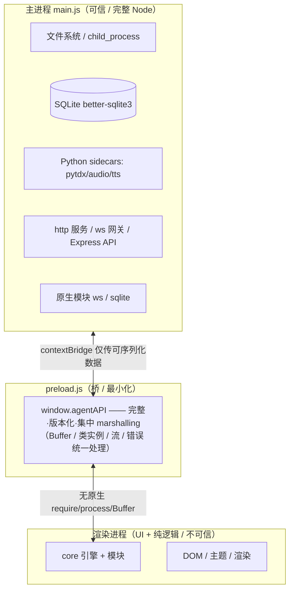

# AI Agent Pro 重构路线图 v2

> 制定日期：2026-07-24
> 适用版本：Electron 42.4.1 / Node 22.x / 约 110 个渲染进程模块 / 当前 253 个测试用例
> 目标：逻辑清晰、架构明确、**最大限度减少「改一处又冒一处」的反复返工**

---

## 〇、诊断：为什么「每一步都难、错误反复出现」

这不是「当初计划缺陷太多」，而是四个具体的结构性原因叠加。认清它们，才能对症下药，而不是继续打地鼠。

### 根因 1（最关键）：测试从未跑在真实环境里 —— 你在当人肉测试

`package.json` 的测试脚本是 `node --test tests/*.test.js`，用**纯 Node** 执行：

- 模块在测试里拿到的是**原生** `require` / `fs` / `Buffer` / `child_process`，以及 mock 出来的 Core 和一个**用正则假装解析 SQL** 的假数据库（`tests/helper.js`）。
- 这正是应用正在**离开**的 `nodeIntegration:true` 世界。
- 全部 253 个用例里，**没有一个**经过真实的 `contextBridge` / `window.nodeBridge` 路径（搜索 nodeBridge / contextBridge / preload / contextIsolation 均为 0 处）。

**后果**：所有「过桥才暴露」的 bug（类实例丢原型、Buffer 代理不一致、代理函数不能 `new`、假 transaction 非原子）在测试里**完全隐形**。每次改完 `npm test` 全绿，你一启动应用就冒新错——因为真正出问题的那条路，从来没有任何测试走过。**这是「反复返工」的头号原因。**

### 根因 2：架构假设与安全模型在对抗

约 110 个模块是按 CommonJS、假设渲染进程有原生 `require` 写的。迁移到 `contextIsolation:true` 后，每个 Node API 都被迫走 preload 里**手写的桥**，而这座桥是逐个 API「长」出来的补丁集合：

- `http.Server` 过桥丢 `.listen/.on/.close` → 闭包代理（preload.js:1289 自己都写了注释）
- `Buffer` → 手搓 `BufferProxy` 纯对象，`bufferBridge.isBuffer` 只认 `_isBufferProxy`，真 `Uint8Array` 或交给 xlsx/marked 就出错
- 类实例 → `{__objId}` 句柄注册表，方法只有被显式补桩的才存在，没补的「静默消失」
- `docx`/`pptxgenjs` → 代理函数不能 `new`，必须在 `_bridgeRequire` 里再用本地构造函书包一层
- `better-sqlite3` 的 `transaction()` 是**假的**（core-v10.js:173 直接调函数，无原子性），渲染进程里事务包裹的保存其实不原子，测试里却显得正常

每补一个 API 就是一处新补丁；任何新代码只要假设「拿到的是真 Buffer / 真类实例」，就是一个新的潜伏 bug——而且按根因 1，**没有任何测试能提前发现它**。

### 根因 3：巨型可变 Core 单例 + 数据路径二义性

`Core`（core-v10.js:436）是挂到 `window.Core` 的单一对象，装着 config、db、所有模块、事件等。`Core.DATA_ROOT` 会在 `setCurrentUser` 时**运行时被改写**成 `users/<名字>/`，而 `Core._globalDataRoot` 保持不变。各模块对「该用哪个」各写各的，还散落硬编码兜底，优先级不一致：

- `file-checkpoint.js`：`Core._globalDataRoot || Core.DATA_ROOT || 'E:\my-ai-data'`
- `deliverables.js` / `pipeline-*.js`：`Core.DATA_ROOT || 'E:\my-ai-data'`
- 还有 `'E:\my-ai-data'`（单反斜杠，JS 里是非法转义）和 `'E:\\my-ai-data'` 混用

**数据到底落在每用户目录还是全局根，取决于某个模块恰好读了哪个字段、当时有没有登录**——这就是「数据消失 / 串用户 / 配置找不到」类 bug 的温床。本次刚修的 pytdx「未找到 venv」就是这一类的典型（venv 在全局根，代码只查每用户目录）。

### 根因 4：失败被静默吞掉，错误在远处变形爆发

`modules/` 下约 923 个 catch，其中约 **190 个是完全空的 `catch {}`**。桥接失败被系统性地转成 `{error:...}` 纯对象或静默返回 `{}`，调用方常常不看 `.error`；全局错误处理只弹个 toast。于是真正的失败降级成一条转瞬即逝的提示甚至无声无息，**回归 bug 在很远的地方、以变形的形式才显现**，离根因越来越远，越来越难查。

### 小结

> 反复返工 = 「在**没有真实环境验证网**的情况下做安全改造」 + 「**架构假设与安全模型对抗**」 + 「全局状态/路径二义」 + 「失败被吞」。
>
> 破局点不是再修一个具体 bug，而是**先把验证网和干净的桥契约立起来**，让此后每一步都能在提交前被真实环境检验。

---

## 一、目标架构（清晰三层 + 一条契约）

不推倒重来（110 个可用模块是资产），而是把现有形状「补完整、定契约、加验证」。

四个明确边界：

1. **主进程（可信）**：一切重 Node 操作——fs、child_process、sqlite、python sidecar、http/ws 服务、原生模块。通过严格定义的 IPC 暴露能力。
2. **preload 桥（最小）**：一个**完整、版本化**的 `window.agentAPI` 契约，只暴露安全且定义良好的操作；Buffer / 类实例 / 流 / 错误的序列化在**一处集中**正确处理，不再每个 API 各搓一套。
3. **渲染进程（不可信）**：core 引擎 + 模块，要么是纯逻辑，要么调桥；**不再直接** `require`/`process`/`Buffer`。
4. **一条路径服务（单一真相源）**：`PathService` 显式区分 `perUser(...)` 与 `global(...)`，消灭散落的 `Core._globalDataRoot || Core.DATA_ROOT || 'E:\my-ai-data'` 和单反斜杠 bug。

配套两条铁律（写进 AGENTS.md）：

- **失败必须可见**：禁止空 catch；桥接错误统一为带 `code` 的结构化错误，调用方必须处理或显式上抛。
- **碰 Node 的改动必须先有过桥测试**：任何新增/修改桥接能力，先补一个走真实 `contextIsolation` 渲染进程的测试。

---

## 二、分阶段路线图

顺序原则：**先立验证网（让后续每一步可被检验）→ 再定型桥契约 → 再治理数据/状态 → 再完成安全迁移 → 最后补功能**。这个顺序保证越往后越顺，而不是越改越乱。

### Phase 0 —— 验证地基：Electron 集成测试网【最高杠杆，先做】

> 目标：让「过桥 bug」在提交前就被抓住，把你从人肉测试里解放出来。这是减少反复返工的**单点最高杠杆**。

具体任务：
1. 引入 Electron 级测试运行器（Playwright for Electron，或 `electron` + 一个最小 harness），启动真实 `BrowserWindow`（`contextIsolation:true`）。
2. 写一组**桥契约冒烟测试**：在真实渲染进程里调用 `window.nodeBridge` 的每类能力——fs 读写（含 Buffer 往返）、crypto（加解密往返）、database（含 transaction 原子性）、http server（listen/request/close）、ws、requireNpm（docx/xlsx 等类实例包）、loadModuleSource。
3. 把现有 253 个纯 Node 单测**保留**（它们验证业务逻辑），新增的这层专门验证「过桥」——两层互补。
4. 接入 CI：`npm test`（Node 单测）+ `npm run test:e2e`（Electron 桥测试）都跑。

验收标准：
- 有一个能在真实 `contextIsolation:true` 渲染进程里跑通的测试命令。
- 桥的每类能力至少一个往返用例；故意制造一个「丢原型」回归能被它红掉。
- 此前反复出现的几类 bug（http.Server.listen、Buffer、API Key 解密）各有对应回归测试。

预估：1.5–2 天。**为什么先做它**：没有它，后面每一步都是盲改；有了它，后面每一步都能自证。

### Phase 1 —— 桥契约定型：把「补丁集合」收敛成「一份契约」

> 目标：消灭根因 2。桥不再逐 API 长补丁，而是一份完整、测试过、集中 marshalling 的契约。

具体任务：
1. 盘点渲染进程实际用到的**全部** Node 能力（从 110 个模块的 `require(...)` 统计），形成桥能力清单。
2. 把 marshalling 收敛到**一处**：统一的 Buffer 往返、统一的类实例句柄（自动补桩而非手工列方法）、统一的流处理、统一的错误结构 `{ok, data, error:{code,message}}`。
3. 修掉**假 transaction**：在 preload 侧用真实 better-sqlite3 transaction 支持，渲染侧 shim 透传，保证原子性。
4. 把 `nativeRequire` 白名单 + `requireNpm` 白名单 + 对象注册表整合进统一契约，移除散落的特殊分支（docx/pptxgenjs 的本地再包装等）。
5. 每收敛一项，Phase 0 的测试同步覆盖。

验收标准：
- 一份 `BRIDGE_CONTRACT.md` 列出全部桥能力与错误码。
- 渲染进程不再有任何「拿到假 Buffer / 假类实例 / 不能 new」的已知路径。
- transaction 原子性有测试证明（中途抛错能回滚）。

预估：3–4 天。

### Phase 2 —— 数据 / 状态层治理：消灭路径二义性与全局耦合

> 目标：消灭根因 3 和根因 4。数据落点可预测，失败可见。

具体任务：
1. 建 `PathService`：`PathService.perUser(sub)` / `PathService.global(sub)`，内部统一用正斜杠与正确转义；**删除所有** `Core._globalDataRoot || Core.DATA_ROOT || 'E:\my-ai-data'` 散落写法与单反斜杠字面量。
2. `Core.DATA_ROOT` 不再被运行时改写造成歧义：需要用户上下文的地方**显式传 userId/上下文**，而非读一个会被偷改的全局。
3. catch 治理：扫描约 190 个空 catch，分级处理——该上抛的上抛、该记日志的记日志、确属「可忽略」的写明注释；桥接错误统一结构化并强制处理。
4. 数据库降级可见性（功能建议 S8）：better-sqlite3 ABI 不匹配降级到 JSON 时，明确提示用户而非静默。

验收标准：
- 全局搜索不到散落的 `|| 'E:\my-ai-data'` 兜底与单反斜杠路径。
- 给定 userId，任何数据的落点可被一句话预测（每用户 or 全局）。
- 空 catch 数量降到接近 0，且剩余均有注释说明。

预估：2–3 天。

### Phase 3 —— 完成安全迁移：contextIsolation:true + sandbox

> 目标：在**有验证网之后**，完成此前「开了又被迫回退」的安全迁移（功能建议 S2，多份报告公认最大技术债）。

具体任务：
1. 确认渲染进程已无任何直接 `require`/`process`/`Buffer`（Phase 1/2 已铺平）。
2. 开启 `contextIsolation:true` + `nodeIntegration:false`，进而 `sandbox:true` + ipcRenderer 通道白名单。
3. API Key 改用 `safeStorage` 加密（S11）；修复「加密密钥绑定机器而非用户、换机/换系统后密钥静默变空」的问题（crypto-utils.js）。
4. 用 Phase 0 的测试网回归全部模块，确保不再白屏。

验收标准：
- `contextIsolation:true` + `sandbox:true` 下全模块功能正常，测试网全绿。
- API Key 经 safeStorage 加密；换用户/重装后行为明确（不再静默清空）。

预估：3–5 天。**为什么放这里**：此前「热修复中强开隔离→白屏→回退」的教训证明，必须先有 Phase 0–2 的地基。

### Phase 4 —— 功能补齐与加固（你告诉我的剩余需求）

> 目标：在稳定地基上补齐功能，此时新增碰 Node 的功能也有测试网兜底，不再引入新桥接 bug。

按优先级（沿用你文档里的 S 编号）：
- **高**：S1 CDN 依赖本地化（marked/highlight.js/mermaid 断网可用）、S7 KaTeX 数学公式。
- **中**：S9 知识库云端嵌入兜底（SiliconFlow /v1/embeddings）、S12 搜索后端健壮性（Tavily/博查 Key）、S5 自动更新（electron-updater）、S6 日志持久化（electron-log）、S10 连接器实现状态对齐（UI 标注真实可用性）、S19 可观测数据持久化。
- **低**：S16 pytdx 自动拉起（本次已修「找不到 venv」，剩自动检测拉起）、S17 应用关闭后定时任务（需主进程常驻/系统计划）、S18 多端云同步、S15 cheerio 替换正则解析、S20 语音部署指引。

验收标准：每项功能附带走过真实桥的测试；CDN 全本地化后断网渲染正常。

预估：每项 0.5–2 天，按需排期。

### Phase 5 —— 进阶（可选，视需求）

- Worker Threads 插件隔离（额外 CPU/内存隔离）。
- 局域网 HTTPS（TLS）。
- 多端云同步服务端（此前已有 4 阶段 8 周方案：ai-agent-server / mobile / node 三仓库）。

---

## 三、需求覆盖对照表（你说的 80% 需求 → 落地阶段）

| 需求域 | 现状 | 落地阶段 |
|---|---|---|
| 多模型对话/路由/Ollama/流式 | 已实现 | 维护，Phase 4 加云嵌入 |
| Agent 循环/状态机/Handoff/深度研究 | 已实现 | 维护 |
| 30+ 斜杠命令/工具调用/文件/Git/Python/浏览器/办公/GitHub | 已实现 | 维护 |
| RAG 知识库/BM25+向量/RRF | 已实现，Ollama 未启时降级 BM25 | Phase 4（S9 云嵌入兜底） |
| 搜索降级链 | 部分可用（CORS/反爬） | Phase 4（S12） |
| 插件沙箱加载 | 已加固 | Phase 5（Worker 隔离） |
| MCP（Tools/Resources/Prompts/stdio/HTTP） | 已实现 | 维护 |
| 语音输入/朗读 | 已实现 | Phase 4（S20 部署指引） |
| 股票/量化（行情/日历/晨报） | 部分（pytdx 本次已修复路径） | Phase 4（S16 自动拉起） |
| Web UI / Gateway / Admin | 已实现（Gateway 经 preload 桥正常） | 维护 |
| 多端云同步 | 未实现 | Phase 5（S18） |
| 导出/PPT/Excel/报告/Webapp | 已实现 | 维护（Phase 1 顺带修 docx/xlsx 过桥） |
| 图像/视频/漫画/OCR | 已实现 | 维护 |
| 定时任务/监控/晨报 | 已实现 | Phase 4（S17 关闭后执行） |
| 三层 Guardrails/CSP/127.0.0.1 绑定 | 已实现 | 维护 |
| contextIsolation 安全 | 反复（开了又回退） | **Phase 3 彻底完成** |
| API Key 加密 | 机器绑定、换机静默失效 | **Phase 3（safeStorage）** |
| CDN 离线依赖 | 未本地化 | **Phase 4（S1，高优先）** |
| 测试覆盖 | 16/110 模块，且不过桥 | **Phase 0（桥测试网）+ 持续补** |
| 自动更新/日志持久化/可观测持久化 | 未实现 | Phase 4（S5/S6/S19） |
| 连接器真实后端 | 多数虚标 | Phase 4（S10 状态对齐） |

---

## 四、执行原则（避免重蹈覆辙）

1. **验证先行**：Phase 0 是地基，任何后续 Phase 开始前它必须就位；此后凡碰 Node/桥的改动，先补过桥测试再改。
2. **不再热修复中强开隔离**：contextIsolation 的开启只发生在 Phase 3，且以测试网全绿为前提。
3. **每个 Phase 有可验证的退出标准**（见上「验收标准」），不达标不进入下一阶段。
4. **小步提交、每步可回滚**：延续本会话的提交纪律（fix: 中文前缀、只提交相关文件、独立工作分离）。
5. **失败可见**：禁止空 catch，错误结构化上抛——让 bug 在源头暴露，而不是在远处变形。
6. **单一真相源**：路径走 PathService，用户上下文显式传递，不再读会被偷改的全局。

---

## 五、立即可做的第一步（Phase 0 起点）

如果你认可这个方向，我建议**马上从 Phase 0 的最小可用版本开始**：

1. 装 Playwright for Electron（或搭一个最小 electron 测试 harness）。
2. 写第一个真实桥测试：启动 `contextIsolation:true` 的 BrowserWindow → 在渲染进程里调 `window.nodeBridge.fs` 做一次「写文件→读文件→Buffer 比对」往返 → 断言一致。
3. 再补一个「http.Server listen→GET→close」往返（正是本次修过、之前反复出错的那类）。
4. 跑通后，把它接进 `npm run test:e2e`。

只要这一个 harness 立起来，之后每一次修改都能先被它检验，「改完测试绿、一用就报错」的循环就被打破了。

---

*本路线图为纯规划文档，未改动任何代码。配套诊断基于对 main.js / preload.js / core-v10.js / modules/（约 110 个）/ tests/ 及 6 份历史报告的完整分析。*
